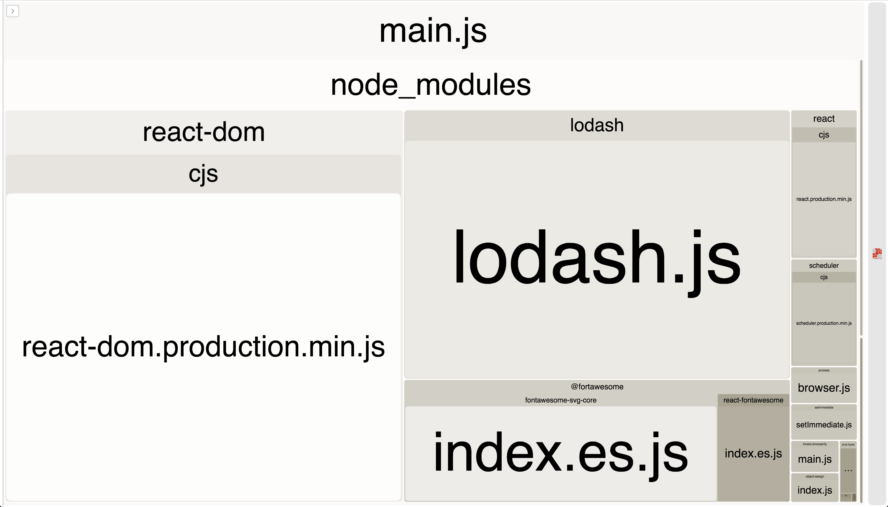

# explicit import

## bundle analyzer



## webpack output

```
Webpack Bundle Analyzer is started at http://127.0.0.1:8888
Use Ctrl+C to close it
Hash: 25eb6a3db14c1253dcfd
Version: webpack 4.39.1
Time: 5758ms
Built at: 08/04/2019 12:46:51 PM
  Asset     Size  Chunks             Chunk Names
main.js  224 KiB       0  [emitted]  main
Entrypoint main = main.js
 [2] (webpack)/buildin/global.js 472 bytes {0} [built]
[12] (webpack)/buildin/module.js 497 bytes {0} [built]
[18] ./src/index.js + 3 modules 656 KiB {0} [built]
     | ./src/index.js 201 bytes [built]
     |     + 3 hidden modules
    + 16 hidden modules
```
